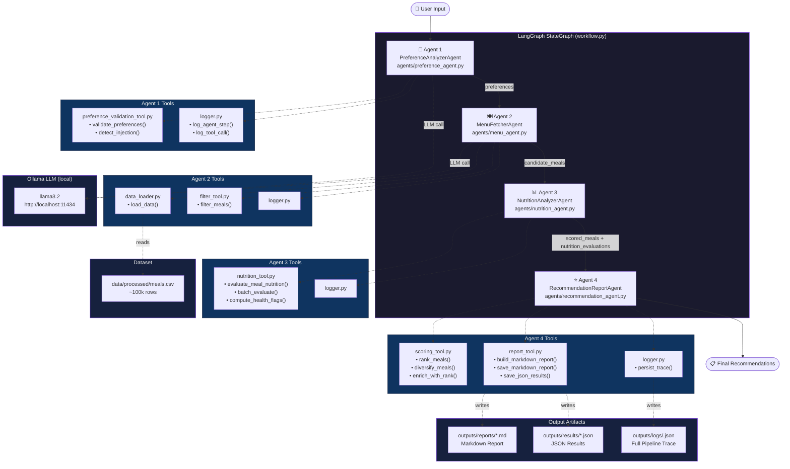
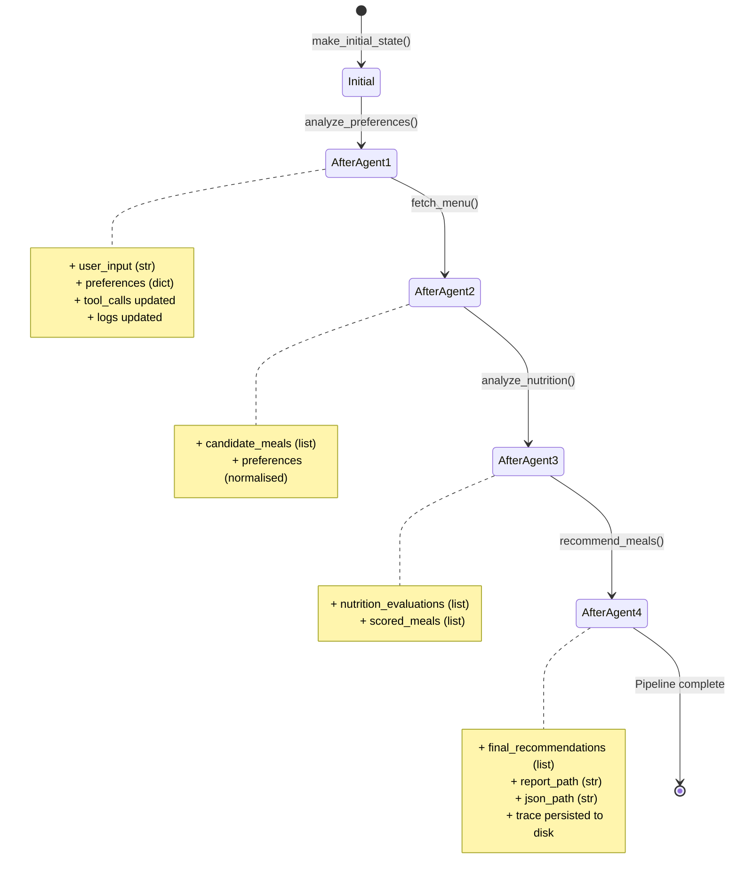

# Architecture — Food Recommendation Multi-Agent System

## System Overview

This system uses a **LangGraph StateGraph** to orchestrate four specialist AI agents
through a sequential pipeline. A single shared `FoodState` TypedDict is passed between
every node; each agent reads its inputs from state and writes its outputs back.

---

## Full Pipeline Diagram

---

## State Flow (FoodState)

---

## Agent Responsibilities

| Agent | Role | LLM Used? | Key Tool(s) |
|-------|------|-----------|-------------|
| **Agent 1** | Parse free-text user query → structured preferences | ✅ (with fallback) | `preference_validation_tool` |
| **Agent 2** | Normalise preferences + filter 100k-row dataset | ✅ (with fallback) | `filter_tool`, `data_loader` |
| **Agent 3** | Score each candidate meal nutritionally | ❌ rule-based | `nutrition_tool` |
| **Agent 4** | Rank, diversify, generate report + trace | ❌ rule-based | `scoring_tool`, `report_tool` |

---

## Web API Endpoints

| Endpoint | Method | Description |
|----------|--------|-------------|
| `GET /` | GET | Serve Web UI (index.html) |
| `POST /api/recommend` | POST | Run full pipeline, return recommendations |
| `GET /api/status` | GET | Check Ollama + dataset availability |
| `GET /api/report/<run_id>` | GET | Download Markdown report for a run |

---

## Security Design

- **Prompt injection detection** in Agent 1 using 10 regex patterns before any LLM call
- **Schema validation** via `preference_validation_tool.py` — all fields type-checked and range-validated
- **Word-boundary matching** in exclusion and diet checks — prevents false positives (e.g., "nut" ≠ "peanut")
- **Local-only LLM** — no data leaves the machine; Ollama runs entirely on-device
